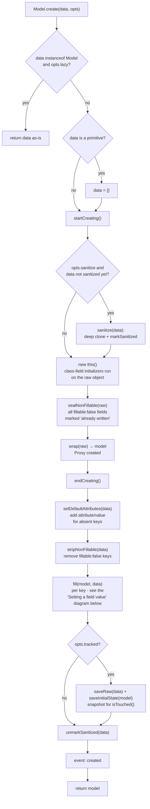
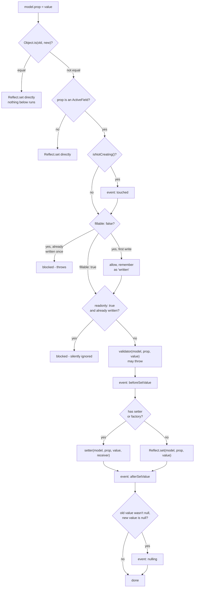
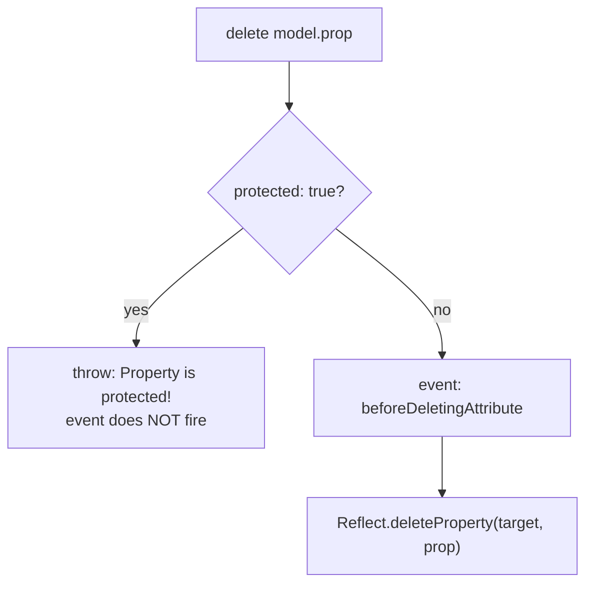

# Model lifecycle

A complete map of what happens to an `ActiveModel` instance from creation to deletion: the order internal
steps run in, which events fire along the way, and what you can subscribe to. Every diagram and claim on
this page has been checked against the source (`src/ActiveModel.ts`, `src/meta.ts`, `src/emitter.ts`) as
of the current package version.

## Creating an instance

`Model.create(data)` — the recommended way (details and why, in
[active-model-advanced.md](active-model-advanced.md#new-model-data-vs-model-create-data-vs-fill-data)):



`new Model(data)` (the direct constructor) takes a shorter path: it wraps `this` in a Proxy and fills it
with data **immediately** - and only afterwards, on the now-returned Proxy, does the subclass's own field
initializers run (this is exactly the cause of the data-loss gotcha covered in
[active-model-advanced.md](active-model-advanced.md#new-model-data-vs-model-create-data-vs-fill-data)).
There's no `sealNonFillable` step on this path - it's specific to `create()`.

`created` still fires for this path too - just not synchronously: it's scheduled via `queueMicrotask` at
the end of the constructor body. Since the subclass's field initializers haven't run yet by the time the
constructor returns, the only point guaranteed to come later than every initializer up the prototype
chain is the next microtask tick - so that's where the emission is deferred to. See the event description
below for details.

## Setting a field value

Fires on **every** `model.prop = value` assignment - whether it's a direct assignment, a call from
`fill()` during creation, or a later `.fill(data)`:



## Deleting a field

Fires on `delete model.prop`:



## Events, one at a time

### `beforeSetValue`

Fires **before** the value is actually written - after the field has passed the `fillable`/`readonly`
checks and `validator` didn't throw, but before `setter`/`Reflect.set` runs. Payload:
`{ target, prop, value, oldValue }`.

```ts
@ActiveField({
  on: {
    beforeSetValue ({ prop, value, oldValue }) {
      console.log(`${prop}: ${oldValue} → ${value}`)
    }
  }
})
status: string = 'new'
```

### `afterSetValue`

Fires right after the value has actually been written (via `setter` or a plain `Reflect.set`). Same
payload as `beforeSetValue`. The most common place for side effects - e.g. recomputing a derived field or
sending a notification.

### `nulling`

A narrow, specialized event: fires only when a field whose value **was not** `null` becomes `null`
explicitly. Transitioning to `undefined` does **not** trigger it - "nulled out" is deliberately treated
differently from "cleared/absent." Useful for logic like "this field had a value and it was explicitly
cleared" as opposed to "this field was never filled in."

### `beforeDeletingAttribute`

Fires before `delete model.prop` - but **only if** the field isn't `protected`. If the field is
`protected: true` (the default for `@ActiveField()`), `delete` throws before the event ever gets a chance
to fire - so this hook can't meaningfully be used on a protected field. Payload: `{ target, prop }` (no
`value`/`oldValue` - there's no value left to report at deletion time).

### `touched` (internal, no payload)

Fires on **any** real change to **any** active field on the instance (not something you subscribe to
per-field via the decorator - `touched` is deliberately excluded from `PropEvent`, the set of events
available in `@ActiveField({ on: {...} })`; you can only subscribe at the instance level:
`model.emitter.on(EventType.touched, cb)`). Used internally to flip a private "this instance has been
touched" flag - but note this is **not** the mechanism behind the public `model.isTouched()` (that one
compares current state against a snapshot saved via `opts.tracked: true` - a separate, independent
mechanism, see [active-model-advanced.md](active-model-advanced.md#new-model-data-vs-model-create-data-vs-fill-data)).

### `created`

Fires **once**, at the very end of `Model.create(data)` (and its variants - `createLazy`, `asyncCreate`,
`asyncCreateLazy`, `createFromCollection`, `createFromCollectionLazy`, `asyncCreateFromCollection*` - they
all eventually call `create()` internally) - after `fill()`, after the `isTouched()` snapshot (if
`opts.tracked`), right before the instance is returned to the caller. No payload - subscribe at the
instance level only: `model.emitter.on(EventType.created, cb)` (like `touched`, `created` is deliberately
excluded from `PropEvent`, the set of events available in `@ActiveField({ on: {...} })` - it's an
instance-level event, not a per-field one).

**Bubbles up from nested models.** If a field is declared with `factory`, the nested model is built via
its own `Model.createLazy(value)` call **inside** the parent's `fill()` - i.e. synchronously, before the
parent's `create()` reaches its own `created`. No separate event-propagation logic was needed for this:
since the nested creation is just a nested (synchronous) call to the same function, the inner `created`
is guaranteed to fire before the outer one, purely from execution order:

```ts
class Child extends ActiveModel {
  @ActiveField() label: string = ''
  static beforeFill (model: any) {
    model.emitter.on(EventType.created, () => console.log('child created'))
  }
}
class Parent extends ActiveModel {
  @ActiveField({ factory: Child }) child?: Child
  static beforeFill (model: any) {
    model.emitter.on(EventType.created, () => console.log('parent created'))
  }
}

Parent.create({ child: { label: 'a' } })
// child created
// parent created
```

(The `beforeFill`-based subscription above isn't the only way to listen - it's just the earliest point
that has a reference to the still-under-construction instance; `beforeFill(model, data)` runs before
fields are filled, i.e. before `created` fires later in that same `create()` call.)

**Fires for `new Model(data)` too - but asynchronously, deferred via `queueMicrotask`.** The direct
constructor has no reliable *synchronous* "the model is truly fully built" moment: it wraps `this` in a
Proxy and fills it with data, but the subclass's own field initializers run *after* the constructor
returns (see the creation diagram above and the breakdown in
[active-model-advanced.md](active-model-advanced.md#new-model-data-vs-model-create-data-vs-fill-data)).
The only point guaranteed to come after every initializer up the entire prototype chain is the next
microtask tick, so that's exactly where the emission is deferred to for this path:

```ts
class User extends ActiveModel {
  @ActiveField() name: string = 'DEFAULT'
  static beforeFill (model: any) {
    model.emitter.on(EventType.created, () => console.log('created, name =', model.name))
  }
}

const user = new User({ name: 'Alice' })
console.log('right after new User(...):', user.name) // 'DEFAULT' - see the gotcha above, data got clobbered
// (still the same synchronous tick - created hasn't fired yet)

await Promise.resolve()
// created, name = DEFAULT
```

Note that `created` here honestly reports `'DEFAULT'`, not `'Alice'` - because that's the model's *actual*
final state after the class-field initializer ran (the documented `new Model(data)` gotcha, in action).
Work around it with the recommended pattern (`super(data)` plus an explicit `this.fill(data)` in your own
constructor) and `created` will just as honestly report `'Alice'` instead.

The difference between the two paths, side by side:

| | `Model.create(data)` | `new Model(data)` |
|---|---|---|
| When it fires | Synchronously, before `create()` returns | Asynchronously, on the next microtask tick |
| Can you rely on ordering against code right after the call | Yes - `created` has already run | No - you need `await` (or `queueMicrotask`/`Promise.resolve().then()`); `created` hasn't happened yet |
| Why | Field initializers have already run by this point (`create()` builds the raw instance before wrapping it in a Proxy) | Field initializers haven't run yet by the time the constructor returns - the only reliable point after all of them is a microtask |

## What else would be worth adding

`created` (described above) is now implemented. The remaining ideas found while tracing the code for this
page, roughly in order of usefulness:

1. **`afterFill` to pair with the existing `beforeFill`.** `beforeFill(model, data)` is currently a
   static hook method, overridable in a subclass, called *before* fields are filled. There's no symmetric
   "after all fields from this call have been filled" - for the top-level `create()` case, `created` now
   covers part of that role, but `fill()` is also called later, independently of creation
   (`model.fill(data)`), and there's still no signal for that case.

2. **A validation-level event, separate from `beforeSetValue`.** Right now the only way to find out that
   `validator` rejected a value is to wrap the assignment in `try/catch` in the calling code. An event
   like `validationError` (or `invalid`) with payload `{ prop, value, error }`, emitted from the same spot
   where `validator` is currently called, would give a central place to log/track invalid attempts -
   without replacing the throw, just complementing it.

3. **`beforeClone`/`afterClone`.** `clone()` is currently a plain `cloneDeepWith` with no hooks. If a
   model holds non-reactive state outside its `@ActiveField` properties (a cache, a reference to an
   external resource), there's currently no way to handle that state correctly during cloning short of
   overriding `clone()` entirely.

4. **`beforeMapTo`/`afterMapTo`.** `mapTo()` currently either finds a handler and calls it, or (in lazy
   mode) silently returns `clone()`. An event around this would let you, say, log the mapping attempt and
   its target without wrapping every `mapTo()` call in application code.
