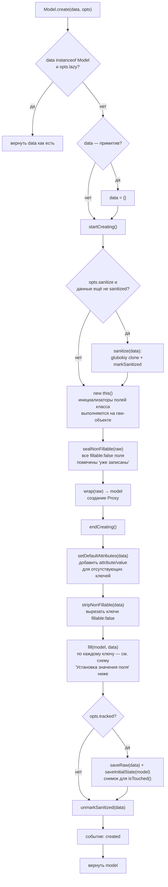
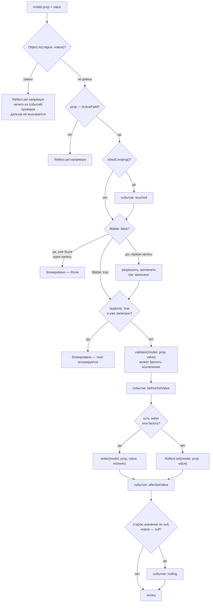
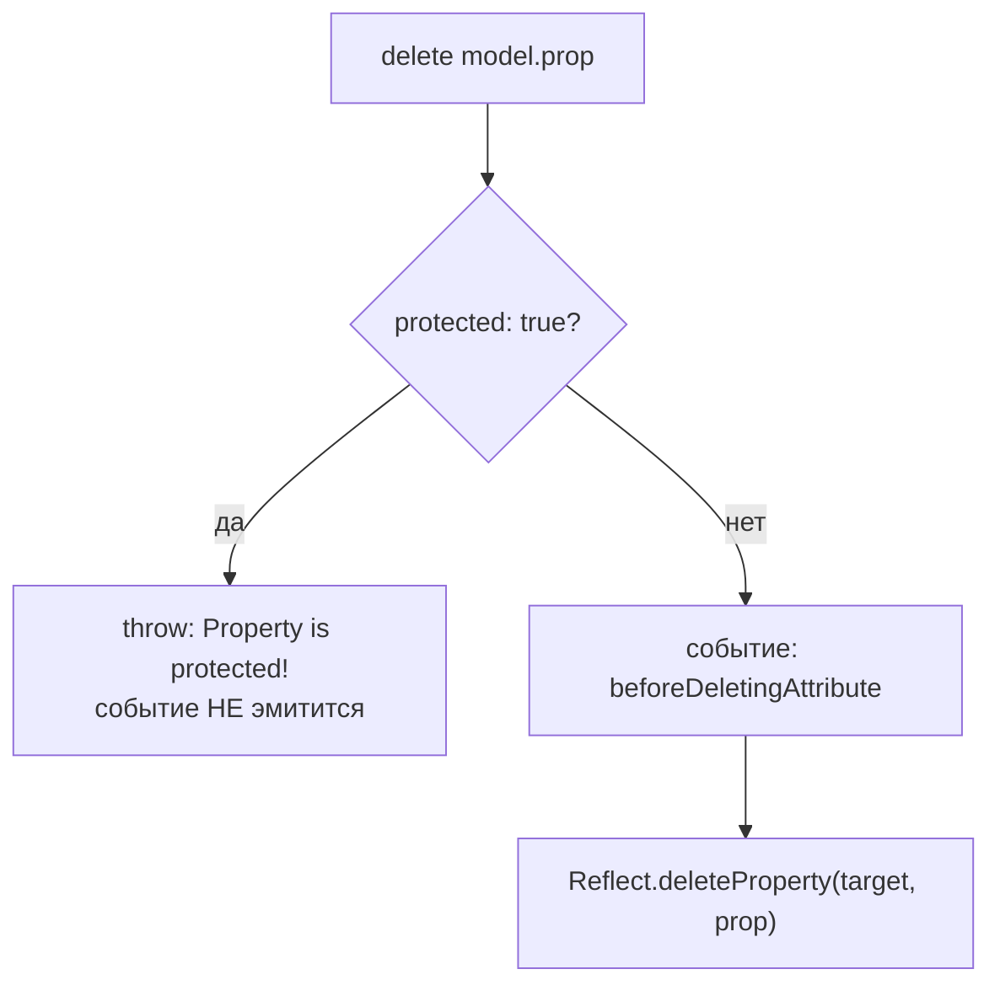

# Жизненный цикл модели

Полная карта того, что происходит с инстансом `ActiveModel` от создания до удаления: в каком порядке
выполняются внутренние шаги, какие события при этом эмитятся, и на что можно подписаться. Все схемы
и утверждения на этой странице сверены с исходным кодом (`src/ActiveModel.ts`, `src/meta.ts`,
`src/emitter.ts`) по состоянию на текущую версию пакета.

## Создание инстанса

`Model.create(data)` — рекомендуемый способ (подробности и почему — в
[active-model-advanced.md](active-model-advanced.md#new-model-data-vs-model-create-data-vs-fill-data)):



`new Model(data)` (прямой конструктор) идёт по короткому пути: **сразу** оборачивает `this` в Proxy и
заполняет данными — и только потом, уже на возвращённом Proxy, выполняются собственные инициализаторы
полей подкласса (это и есть причина "ловушки" с потерей данных, разобранной в
[active-model-advanced.md](active-model-advanced.md#new-model-data-vs-model-create-data-vs-fill-data)). Шага
`sealNonFillable` в этом пути нет — он специфичен для `create()`.

`created` для этого пути тоже эмитится — но не синхронно, а через `queueMicrotask`, запланированный в
конце тела конструктора. Так как на момент возврата из конструктора инициализаторы полей подкласса ещё
не отработали, единственная гарантированно более поздняя точка — следующий тик микрозадач: к этому
моменту вся синхронная конструкция (конструктор + все инициализаторы вверх по цепочке прототипов)
абсолютно точно завершена. Подробнее — в описании события ниже.

## Установка значения поля

Срабатывает при **каждом** присваивании `model.prop = value` — будь то прямое присваивание, вызов из
`fill()` во время создания, или более поздний `.fill(data)`:



## Удаление поля

Срабатывает на `delete model.prop`:



## События по отдельности

### `beforeSetValue`

Эмитится **перед** фактической записью значения — после того, как поле прошло проверки `fillable`/
`readonly` и `validator` не бросил исключение, но до вызова `setter`/`Reflect.set`. Payload:
`{ target, prop, value, oldValue }`.

```ts
@ActiveField({
  on: {
    beforeSetValue ({ prop, value, oldValue }) {
      console.log(`${prop}: ${oldValue} → ${value}`)
    }
  }
})
status: string = 'new'
```

### `afterSetValue`

Эмитится сразу после того, как значение реально записано (через `setter` или обычный `Reflect.set`).
Тот же payload, что и у `beforeSetValue`. Самое частое место для побочных эффектов — например,
пересчитать производное поле или отправить уведомление.

### `nulling`

Узкоспециализированное событие: срабатывает, только когда поле, значение которого **не было** `null`,
становится `null` явно. Переход в `undefined` это событие **не** вызывает — обнуление специально
отличается от очистки/отсутствия значения. Полезно для логики вида "поле было заполнено, а теперь его
явно очистили" (в отличие от "поле изначально не заполнялось").

### `beforeDeletingAttribute`

Эмитится перед `delete model.prop` — но **только если** поле не `protected`. Если поле `protected: true`
(это значение по умолчанию для `@ActiveField()`), `delete` бросает исключение раньше, чем событие
успевает сработать — то есть на защищённое поле этот хук в принципе не подписаться содержательно.
Payload: `{ target, prop }` (без `value`/`oldValue` — значения на момент удаления в событии нет).

### `touched` (внутреннее, без payload)

Эмитится при **любом** реальном изменении **любого** активного поля инстанса (не поштучно
подписываемое через декоратор — `touched` намеренно исключён из `PropEvent`, набора событий, доступных
в `@ActiveField({ on: {...} })`; подписаться можно только на уровне инстанса:
`model.emitter.on(EventType.touched, cb)`). Используется внутри библиотеки, чтобы выставить приватный
флаг "инстанс трогали" — но учтите: это **не** тот механизм, который стоит за публичным
`model.isTouched()` (тот сравнивает текущее состояние со снимком, сохранённым через
`opts.tracked: true`, — независимый механизм, см. [active-model-advanced.md](active-model-advanced.md#new-model-data-vs-model-create-data-vs-fill-data)).

### `created`

Эмитится **один раз**, в самом конце `Model.create(data)` (и его вариантов — `createLazy`, `asyncCreate`,
`asyncCreateLazy`, `createFromCollection`, `createFromCollectionLazy`, `asyncCreateFromCollection*` —
все они в итоге вызывают `create()` внутри) — после `fill()`, после снимка для `isTouched()` (если
`opts.tracked`), непосредственно перед возвратом инстанса вызывающему коду. Без payload — подписка
только на уровне инстанса: `model.emitter.on(EventType.created, cb)` (как и `touched`, `created`
намеренно исключён из `PropEvent`, набора событий, доступных в `@ActiveField({ on: {...} })` — это
событие уровня всего инстанса, а не конкретного поля).

**"Всплывает" из вложенных моделей.** Если поле объявлено с `factory`, вложенная модель создаётся
через собственный `Model.createLazy(value)` **внутри** `fill()` родителя — то есть синхронно, до того,
как родительский `create()` дойдёт до своего собственного `created`. Никакой отдельной логики
проброса событий для этого не потребовалось: раз вложенное создание — это вложенный (синхронный) вызов
той же функции, вложенный `created` гарантированно эмитится раньше внешнего просто в силу порядка
выполнения:

```ts
class Child extends ActiveModel {
  @ActiveField() label: string = ''
  static beforeFill (model: any) {
    model.emitter.on(EventType.created, () => console.log('child created'))
  }
}
class Parent extends ActiveModel {
  @ActiveField({ factory: Child }) child?: Child
  static beforeFill (model: any) {
    model.emitter.on(EventType.created, () => console.log('parent created'))
  }
}

Parent.create({ child: { label: 'a' } })
// child created
// parent created
```

(Подписка выше через `beforeFill` — не единственный, а просто самый ранний момент, когда есть ссылка на
ещё строящийся инстанс; `beforeFill(model, data)` вызывается до заполнения полей, то есть до того, как
позже в этом же `create()` дойдёт очередь до `created`.)

**Для `new Model(data)` эмитится тоже — но асинхронно, отложенно через `queueMicrotask`.** У прямого
конструктора нет надёжного *синхронного* момента "модель точно полностью готова": он оборачивает `this`
в Proxy и заполняет данными, но собственные инициализаторы полей подкласса выполняются *после* возврата
из конструктора (см. диаграмму создания выше и разбор в
[active-model-advanced.md](active-model-advanced.md#new-model-data-vs-model-create-data-vs-fill-data)).
Единственная точка, гарантированно наступающая позже вообще всех инициализаторов по цепочке
прототипов — следующий тик микрозадач, поэтому именно туда и отложена эмиссия для этого пути:

```ts
class User extends ActiveModel {
  @ActiveField() name: string = 'DEFAULT'
  static beforeFill (model: any) {
    model.emitter.on(EventType.created, () => console.log('created, name =', model.name))
  }
}

const user = new User({ name: 'Alice' })
console.log('сразу после new User(...):', user.name) // 'DEFAULT' — см. ловушку выше, данные затёрты
// (мы ещё в том же синхронном тике — created пока не сработало)

await Promise.resolve()
// created, name = DEFAULT
```

Обратите внимание: `created` в этом примере честно репортит `'DEFAULT'`, а не `'Alice'` — потому что
это и есть *реальное* финальное состояние модели после отработки инициализатора класса (та самая
задокументированная ловушка `new Model(data)`). Если обойти её через рекомендуемый паттерн
(`super(data)` + явный `this.fill(data)` в собственном конструкторе), `created` точно так же честно
покажет `'Alice'`.

Разница между путями по срабатыванию `created`:

| | `Model.create(data)` | `new Model(data)` |
|---|---|---|
| Когда эмитится | Синхронно, до возврата из `create()` | Асинхронно, на следующем тике микрозадач |
| Можно ли положиться на порядок относительно кода сразу после вызова | Да — `created` уже отработал | Нет — нужен `await` (или `queueMicrotask`/`Promise.resolve().then()`), иначе `created` ещё не наступил |
| Почему так | Инициализаторы полей уже отработали к этому моменту (`create()` строит сырой инстанс до обёртки в Proxy) | Инициализаторы полей ещё не отработали к моменту возврата из конструктора — единственная надёжная точка позже них всех — микрозадача |

## Что ещё стоило бы добавить

`created` (описан выше) уже реализован. Остальные идеи, найденные при разборе кода для этой страницы —
в порядке убывания полезности:

1. **`afterFill` в пару к уже существующему `beforeFill`.** Сейчас `beforeFill(model, data)` — это
   статический метод-хук, переопределяемый в подклассе, вызывается *до* заполнения полей. Симметричного
   "после заполнения всех полей из этого вызова" нет — для верхнеуровневого `create()` эту роль отчасти
   закрывает `created`, но `fill()` вызывается и позже, отдельно от создания (`model.fill(data)`), и там
   такого сигнала по-прежнему нет.

2. **Событие уровня валидации, отдельное от `beforeSetValue`.** Сейчас единственный способ узнать, что
   `validator` отклонил значение — обернуть присваивание в `try/catch` в вызывающем коде. Событие вида
   `validationError` (или `invalid`) с payload `{ prop, value, error }`, эмитимое из того же места, где
   сейчас вызывается `validator`, дало бы централизованное место для логирования/телеметрии невалидных
   попыток — не заменяя throw, а дополняя его.

3. **`beforeClone`/`afterClone`.** `clone()` сейчас — чистый `cloneDeepWith` без хуков. Если модель
   держит нереактивное состояние вне `@ActiveField`-полей (например, кэш или ссылку на внешний ресурс),
   сейчас нет способа корректно обработать это состояние при клонировании, кроме переопределения
   `clone()` целиком.

4. **`beforeMapTo`/`afterMapTo`.** `mapTo()` сейчас либо находит обработчик и вызывает его, либо (в lazy
   режиме) молча возвращает `clone()`. Событие вокруг этого позволило бы, например, залогировать сам факт
   и цель маппинга без обёртывания каждого вызова `mapTo()` в приложении.

Пункт 1 — единственный, где "чего-то не хватает" в буквальном смысле уже объявленного, но не
реализованного API; остальные — расширения по аналогии с тем, что уже есть.
